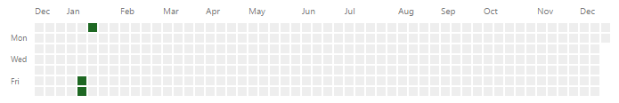
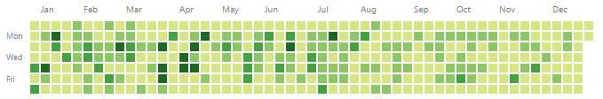
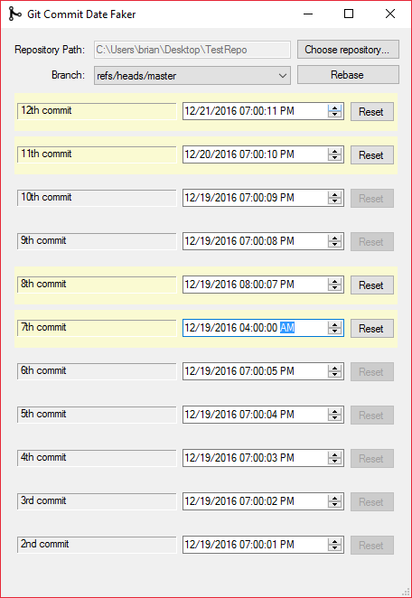

# Git Commit Date Faker

This repository contains two projects used to change the dates of commits
in git repositories. It was an evening project to learn interactive rebases better.

By changing the dates of commits in your GitHub 
repositories, you can win friends and influence people by changing 
your GitHub contribution graph from this:

to this:

But you shouldn't. I wrote a blog post about building this 
[here](http://blog.briandrupieski.com/hacking-github-contribution-graph).

This currently only works on Windows.

## GitCommitDateFaker

GitCommitDateFaker is a Windows Forms application that uses a 
combination of LibGit2Sharp and calls to cmd.exe to automate interactive
rebases.

It uses LibGit2Sharp for retrieving branches and commits but needs to
make calls to the system's installed git through cmd.exe because the
specific rebase operations it needs aren't implemented in LibGit2Sharp.

It looks something like this:

## SequenceEditor

SequenceEditor is a simple console application used by GitCommitDateFaker
as the editor supplied to the environment variable GIT_SEQUENCE_EDITOR. 
Git opens the editor supplied to this variable to open the sequence file
where the rebase action (pick, reword, edit, etc.) for each commit is 
specified.

SequenceEditor reads in the sequence file
and changes each line starting with "pick " to "edit ". I couldn't get
GIT_SEQUENCE_EDITOR to take a sed script in a normal command window in
Windows (like the ones in 
[this Stack Overflow question](http://stackoverflow.com/questions/12394166/how-do-i-run-git-rebase-interactive-in-non-interactive-manner)) 
so I built this as a replacement.
